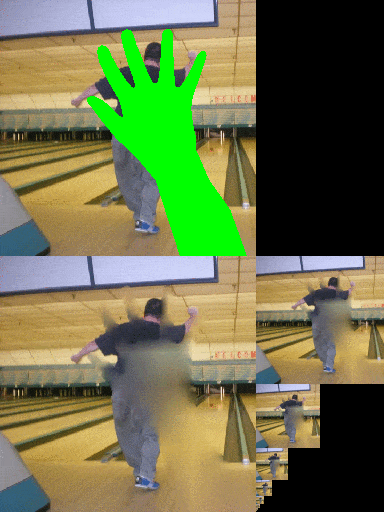

# Image Inpainting (Processing)
Small test project for pyramidal image inpainting in Processing v.3.5.3.

*key words: image inpainting; image completion*

---

#### Pyramidal Image Inpainting

This algorithm [as described by Chema Guerra](http://chemaguerra.com/filling-of-missing-image-pixels/) works in 2 stages:

1. The first stage (analysis) prepares the mean pyramid of the source 
 image by doing progressive 1:2 downscalings. Only the meaningful (not-a-hole) 
 pixels in each 2×2 packet are averaged down. If a 2×2 packet does not have 
 any meaningful pixels, a hole is passed to the next (lower) level.
 
2. The second stage (synthesis) starts at the smallest level and goes up, 
 leaving meaningful pixels intact, while replacing holes by upscaled data 
 from the previous (lower) level.
 
The project assumes that pixels to be filled have a special "mask" color, such as #00FF00. Other approaches (e.g. using an alpha channel) would be better.

*Sample results in 256x256 using a green mask:*  

#### References: 

* http://chemaguerra.com/filling-of-missing-image-pixels/
* http://wwwvis.informatik.uni-stuttgart.de/~kraus/preprints/vmv06_strengert.pdf
* https://rosettacode.org/wiki/Bilinear_interpolation#Java
* https://github.com/kosua20/Rendu
* https://github.com/cheind/inpaint

 
#### Performance: 

Very modest; this is not optimized or GPU code. About 3ms for 256x256 pixel image, with approx. 20% pixels masked, on MacBook Pro (Early 2013), 3GHz Intel Core i7. Sample images from Flickr CC.